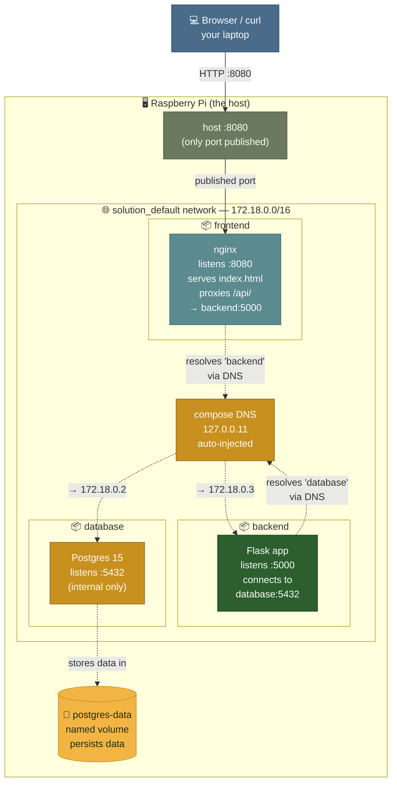

# Architecture — Step 6 (compose world)

The same three-tier application, but now wired together by docker-compose.
Manual flags (`--add-host`, `--network host`) are gone. Service-name DNS handles everything.

## What changed from Step 5

| Step 5 (manual) | Step 6 (compose) |
|---|---|
| `--add-host=backend:host-gateway` on frontend | Service name `backend` resolves via compose DNS |
| `--network host` on backend | Joins the `solution_default` network like every other service |
| `-p 5432:5432` on postgres (exposed externally) | Internal only — never published, never reachable from outside |
| `-p 5000:5000` on backend (exposed externally) | Internal only |
| Three separate `docker run` commands | One `docker compose up` |
| Manual ordering / sleeps | `depends_on` with healthcheck conditions |
| No data persistence guarantee | Named volume `postgres-data` survives container removal |

The cleanest observation: **only one port published to the outside world.** The Pi exposes 8080 (nginx) and nothing else. Backend and database are reachable only from within the compose network. That's a security improvement that came for free.
