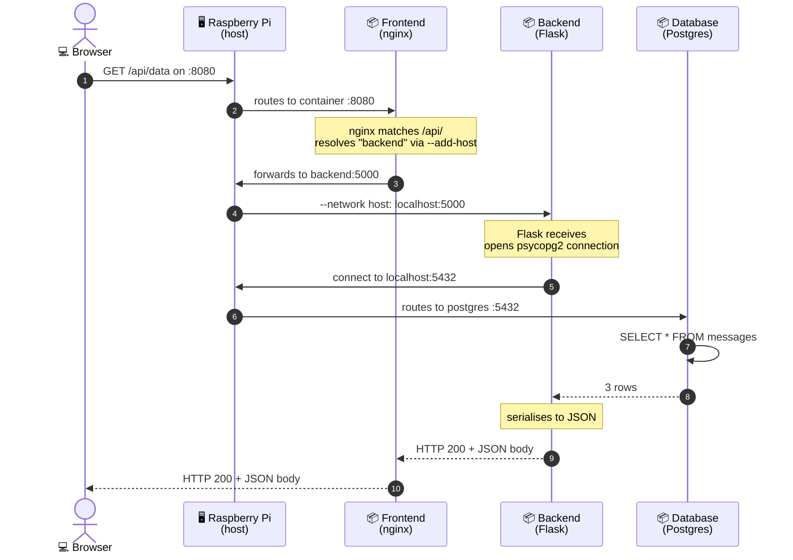

```mermaid
sequenceDiagram
    autonumber
    actor Browser as 💻 Browser
    participant Pi as 🖥️ Raspberry Pi<br/>(host)
    participant Frontend as 📦 Frontend<br/>(nginx)
    participant Backend as 📦 Backend<br/>(Flask)
    participant Database as 📦 Database<br/>(Postgres)

    Browser->>Pi: GET /api/data on :8080
    Pi->>Frontend: routes to container :8080
    Note over Frontend: nginx matches /api/<br/>resolves "backend" via --add-host
    Frontend->>Pi: forwards to backend:5000
    Pi->>Backend: --network host: localhost:5000
    Note over Backend: Flask receives<br/>opens psycopg2 connection
    Backend->>Pi: connect to localhost:5432
    Pi->>Database: routes to postgres :5432
    Database->>Database: SELECT * FROM messages
    Database-->>Backend: 3 rows
    Note over Backend: serialises to JSON
    Backend-->>Frontend: HTTP 200 + JSON body
    Frontend-->>Browser: HTTP 200 + JSON body
```
