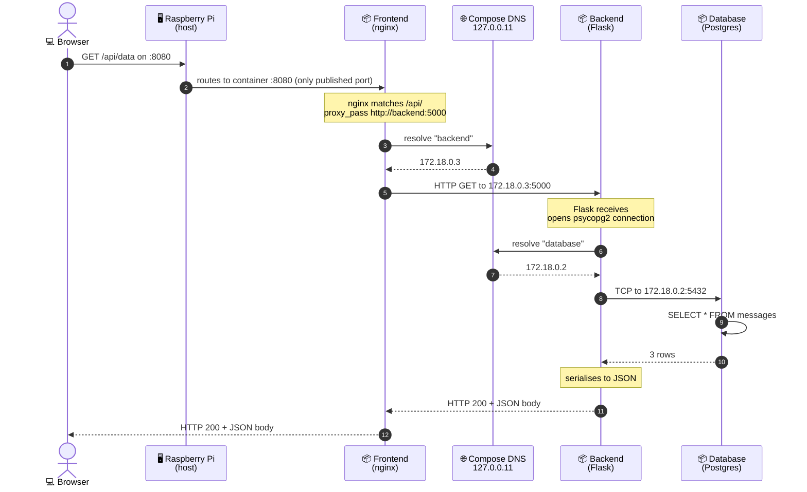

# The Journey of a Request — Step 6 (compose)

Same `/api/data` request as Step 5, but the wiring underneath is now compose-managed.
No more `--add-host`. No more `--network host`. Service names just resolve.

## How this is different from Step 5

Look at the new participant: **Compose DNS at 127.0.0.11.** That's the actor doing all the wiring.

In Step 5, the equivalent role was played by:
- `--add-host=backend:host-gateway` for the frontend→backend leg
- `--network host` for the backend→database leg

Both manual. Both fragile. Compose replaces them with a single mechanism — embedded DNS that knows every service name in the network. Every container queries the same DNS server. Every service name resolves correctly. **No flags. No tricks. Just a contract.**

## The wider lesson

This pattern — *service names resolved via internal DNS* — is the same mental model used by:

- **Kubernetes Services** (where `backend.default.svc.cluster.local` is the equivalent of `backend`)
- **AWS Service Discovery** (Cloud Map)
- **Consul**, **Nomad**, **Nomad Connect**
- Every modern service mesh

What we just built in compose is a miniature version of how every real production cluster does service-to-service communication. **Module 3 will feel familiar** — the K8s equivalent is `Service` resources, and the DNS just works the same way at scale.
